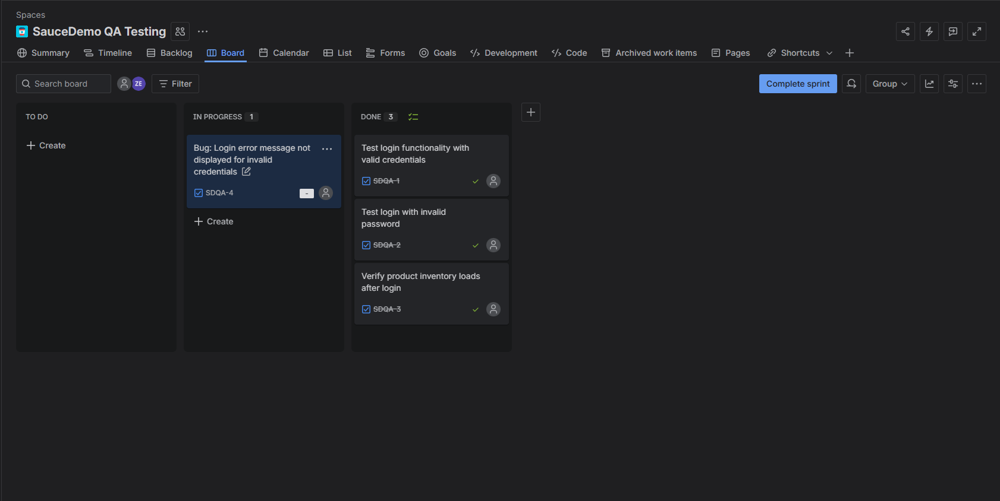
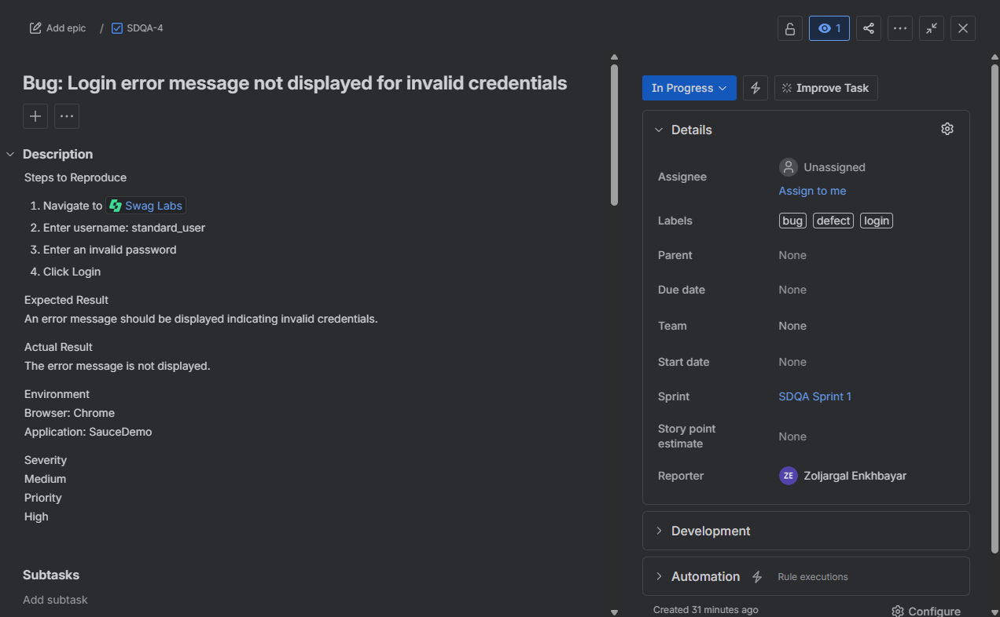
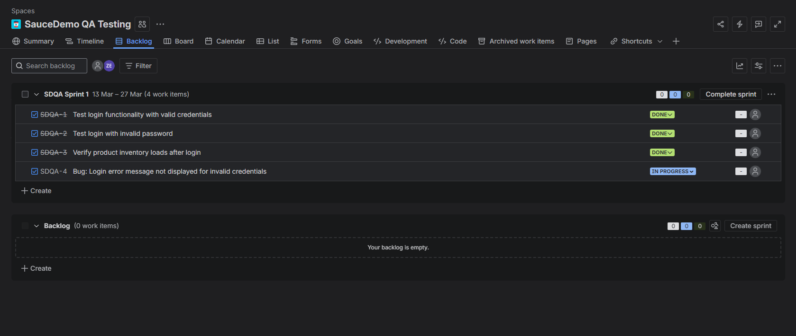

# Playwright E2E Automation – SauceDemo

End-to-end test automation project built with Playwright and TypeScript to validate core e-commerce workflows in the SauceDemo application.

This project demonstrates the complete QA testing lifecycle, including test planning, JIRA-based task management, defect tracking, automated UI testing, and CI/CD integration.

---

## 🚀 Tech Stack

* Playwright
* TypeScript
* Node.js
* JIRA (test management & bug tracking)
* GitHub Actions (CI/CD)

---

## 🎯 Test Coverage

The automated tests validate key user workflows within the application:

* Login scenarios (valid user, invalid password, locked-out user) using data-driven testing
* Product inventory functionality (adding products to the cart)
* Cart functionality (verifying added products)

---

## 🧪 Sample Test Cases

| ID   | Scenario          | Steps                                   | Expected Result                      |
| ---- | ----------------- | --------------------------------------- | ------------------------------------ |
| TC01 | Valid Login       | Enter valid credentials and click login | User is redirected to inventory page |
| TC02 | Invalid Login     | Enter wrong password                    | Error message is displayed           |
| TC03 | Locked User Login | Enter locked-out user credentials       | User is blocked and error shown      |
| TC04 | Add to Cart       | Click "Add to Cart" on a product        | Product appears in cart              |
| TC05 | Verify Cart       | Navigate to cart page                   | Selected product is displayed        |

---

## 🐞 Sample Bug Report

**Title:** Login fails with valid credentials

**Steps to Reproduce:**

1. Navigate to login page
2. Enter valid username and password
3. Click login

**Expected Result:**
User should be redirected to inventory page

**Actual Result:**
Error message is displayed

**Severity:** High
**Priority:** High

---

## 📂 QA Artifacts

This project includes QA management artifacts demonstrating the testing workflow.

Artifacts are located in the `qa-artifacts` folder:

* Test Plan
* JIRA Sprint Backlog
* JIRA Bug Report Example
* Test Execution Workflow Screenshots

---

## 📸 QA Workflow Screenshots

### JIRA Board Workflow



### Bug Report Example



### Sprint Backlog



---

## 🛠 Project Structure

```
playwright-e2e-saucedemo
│
├── tests
├── pages
├── playwright.config.ts
│
└── qa-artifacts
    ├── jira-board-workflow.png
    ├── jira-bug-report.png
    ├── jira-sprint-backlog.png
    └── test-plan.md
```

---

## ▶️ How to Run the Tests

Install dependencies:

```
npm install
```

Run the Playwright test suite:

```
npx playwright test
```

---

## 🚀 Key Achievements

* Automated 15+ end-to-end test cases covering critical user workflows
* Implemented Page Object Model (POM) for scalable test architecture
* Integrated automated tests into CI/CD pipeline using GitHub Actions
* Simulated real-world QA workflow using JIRA for test management and defect tracking

---

## 👤 Author

**Zoljargal Enkhbayar**
Computer Science – Saint Cloud State University
